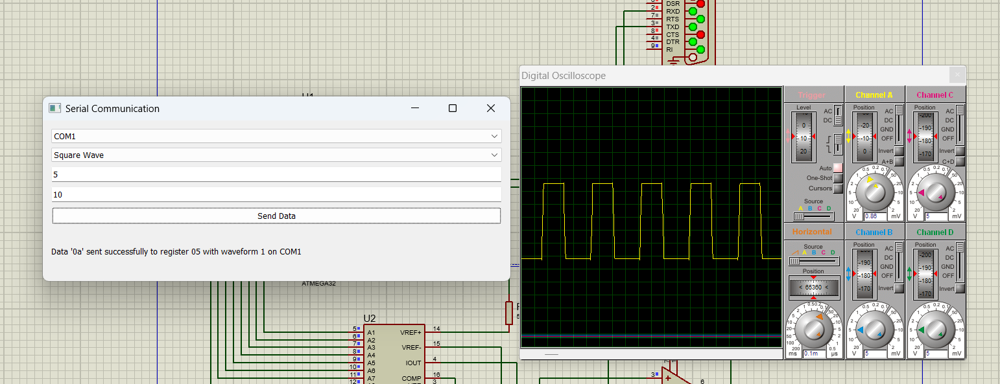

# Wave Generator Project

Welcome to the Wave Generator project! This project provides a powerful tool for generating a variety of waveforms using a microcontroller and a graphical user interface (GUI) developed with PyQt5. The device can generate waveforms such as sine, square, triangle, and staircase waves, with customizable frequency and amplitude.

## Features

- **GUI**: The intuitive GUI allows you to select the type of waveform, set the amplitude and frequency, and control the microcontroller with ease.
- **Waveform Selection**: Choose from various waveforms such as sine, square, triangle, and staircase.
- **Customizable Parameters**: Adjust the amplitude and frequency of the selected waveform to suit your needs.
- **Communication**: The GUI communicates with the microcontroller via UART using the `serial` library.
- **Digital-to-Analog Converter (DAC)**: The microcontroller sends the received information to the DAC, which generates the desired waveform.
- **Oscilloscope Representation**: The output waveform can be visualized using an oscilloscope for verification and analysis.

## Requirements

- Python 3.x
- PyQt5 library
- Serial library
- A compatible microcontroller with UART support
- An oscilloscope for waveform visualization

## Installation

1. **Clone the repository**:
    ```bash
    git clone [https://github.com/AhmedMohamedomar74/Wave-Generator.git]
    ```

2. **Install dependencies**:
    ```bash
    pip install PyQt5 pyserial
    ```

## Usage

1. **Connect the microcontroller**: Ensure that the microcontroller is connected to your system via a serial port (e.g., USB).
2. **Run the GUI**:
    ```bash
    python GUI.py
    ```

3. **Select parameters**: In the GUI, choose the type of waveform, set the amplitude and frequency.
4. **Generate waveform**: Click the button to send the parameters to the microcontroller.
5. **Visualize waveform**: Observe the generated waveform on an oscilloscope.

## Circuit and Waveform Images

This section provides images of the circuit simulation and the different waveforms generated by the wave generator.

### Circuit Simulation

Below is an image of the circuit setup in the simulation program. This circuit demonstrates the connection between the microcontroller, DAC, and other necessary components to generate the desired waveforms.


### Waveform Examples

Here are examples of the waveforms generated by the wave generator using the specified parameters:

- **Sine Wave**: This is a smooth, periodic waveform.

    

- **Square Wave**: This waveform alternates between high and low levels with a 50% duty cycle.

    

- **Triangular Wave**: This waveform is a linear, sawtooth pattern with a peak and valley.

    

- **Staircase Wave**: This waveform consists of discrete steps that gradually increase or decrease in amplitude.

    

These images provide visual examples of the waveforms that can be generated by the wave generator. Use these as references for understanding the output of your circuit and wave generator.

## Acknowledgments

Special thanks to the open-source community and the developers of `PyQt5` and the `serial` library for making this project possible.
